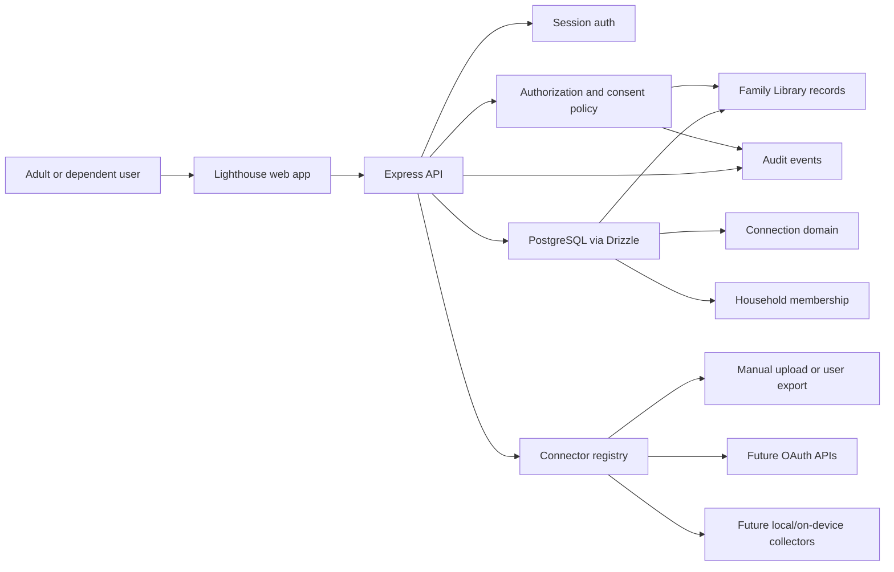

# System Context

## Current Components

- `artifacts/family-app`: frontend shell, auth pages, Today, Family, Library, Together/Connection, and Privacy.
- `artifacts/api-server`: Express routes, session auth, seeded demo data, Library policy enforcement, and redacted Library audit writes.
- `lib/db`: Drizzle schema source, including Passport ID, Family Library, sharing grants, consent/source/record foundations, connector registry, signals, and audit events.
- `lib/api-spec`: OpenAPI source and generated API clients.

## Boundary Rules

- Browser route protection is convenience only; authorization must be enforced in API routes.
- Household membership is not sufficient for adult private data access.
- Search/list and direct fetch must use the same policy.
- Audit summaries must avoid sensitive content.
- External connector availability must be represented as capability metadata, not assumed by UI copy.
